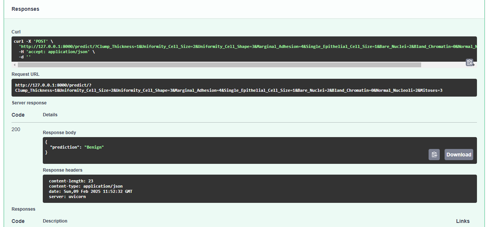
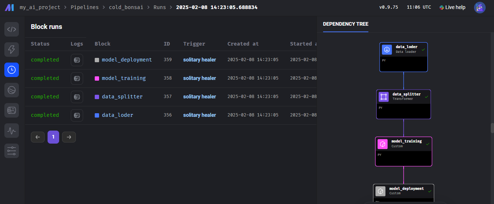
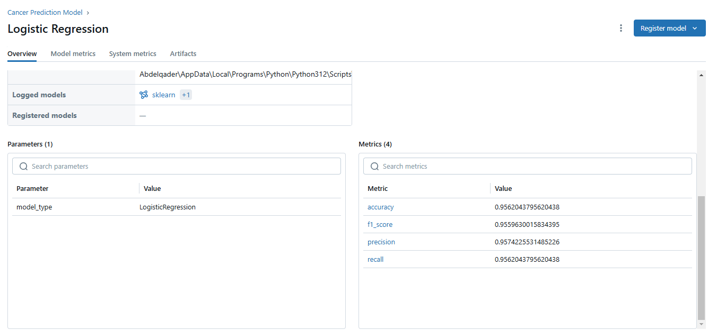

# Breast Cancer Pipeline

This project aims to build an ML pipeline that automatically runs every hour using Mage AI. The pipeline reads data for cancer patients, splits it into training and testing sets, scales the data, trains a logistic regression model, stores and displays the results on MLflow, and finally deploys the model using FastAPI.

**Prerequisites:**  
1. Python (>=3.8)  
2. Visual Studio Code  

**Instructions:**  
1. Install dependencies using:  
   ```bash
   pip install -r requirements.txt
   ```  
2. Open Mage AI using:  
   ```bash
   mage start my_ai_project
   ```  
3. Open MLflow using:  
   ```bash
   mlflow ui
   ```  
4. Open the MLflow UI in a browser using:  
   [http://127.0.0.1:5000](http://127.0.0.1:5000)  
5. Open the FastAPI UI in a browser using:  
   [http://127.0.0.1:8000/docs](http://127.0.0.1:8000/docs)

## Fast API UI


## Mage-AI UI


## MLFlow UI

